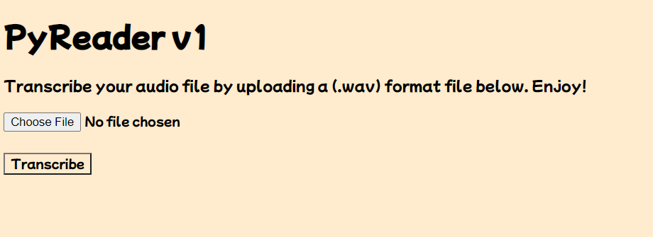

# PyReader v1

In this project I was able to create a site that allows users to upload .wav format files and transcribe to text. The goal was to learn more about the power of the python library SpeechRecognition. While working on the software, I was able to connect the Google Speech Recognition engine to transcribe the text from the .wav file.

## Installing Flask & Speech Recognition

pip install flask

pip install SpeechRecognition

